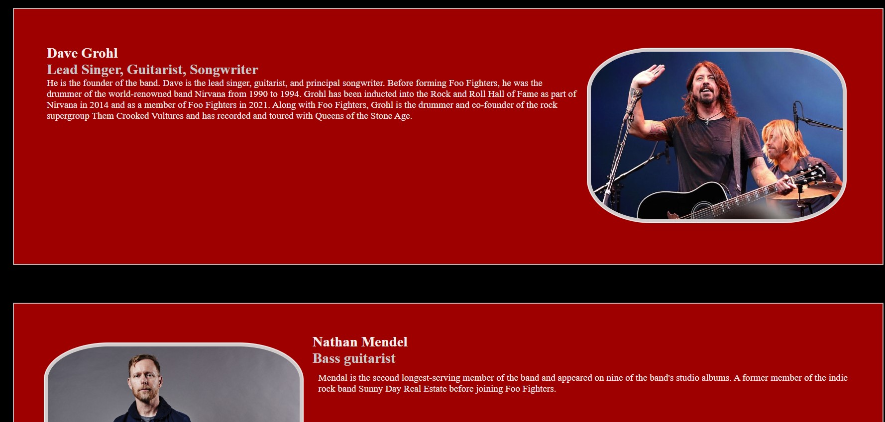

# Foo Fans ie
## A website built to display information on the band Foo Fighters
### Mile Stone 1 - Luke Courtney
----------------------------------------------
> Foo Fans Ie is a website created to provide information on the American rock band Foo Fighters to new listeners of their music.

> This website is showcasing HTML and CSS design for Project Portfolio 1 that can be accesed though this [Link](https://lukecdev.github.io/foo-fans-ie/)

----------------------------------------------

## **[Respository](https://github.com/lukecdev/foo-fans-ie)**
----------------------------------------------

----------------------------------------------

## Table of contents

1. [ UX ](#ux)
2. [ Features ](#features)
3. [ Features left to Implement ](#left)
4. [ Technology used ](#tech)
5. [ Testing ](#test)
6. [ Bugs ](#bugs)
7. [ Deployment ](#deployment)
8. [ Credits ](#credits)
9. [ Acknowledgements ](#acknowledgements)

## UX

# UX design

I designed thios website as an introduction of the American band Foo Fighters to new listioners. Providing information on their band members, history and discography.

## Skeleton Plane

### Wireframes

>The design flow of this was meant to showcase a minimal design that displays concise information on all devices. 
>As the project was created, the inital design was too time consuming for the given time frame. The project was adapted to help this.
>The main color theme was mainly black and red to reflect the bands color. 

## Features
>The following is a summery of the features already in place.
### index.html

#### Navigation Bar

> Navigation bar developed with flex containers and contains the website logo with two links to the right of the logo.

#### Hero Section

> A large image with large text overlayed. 

#### Members Zig-Zag Section

> Mmembers section displaying members of the band. A zig-zag is used to cleanly display the images and text.

#### Discography

> A card box layout to display in order the albums covers and information. 

## Existing Features

> Navigation with links

### Features left to Implement

> These are features that I would have liked to implement for the site if I had more available time and more knowledge on the subject. 

## Technoligies Used

### Html
>Used to structure my webpages.

### CSS
>Used to provide style, layout and responsiveness to my website.

### Font Awesome
>Used for all the social media icons.

### Google Fonts
>Used for all the fonts on my website.

### Canva
>Used to design The Forty Foot logo used in Header.

### Online-Convert.com
>Used to convert files from png/jpg to webp to reduce size and improve web loading speed.

## Accessibility Features 
>

## Testing
>Testing on this project was mainly done by myself and a few friends to determine site usablity, reponsiveness and ensure its intuitive to a new user.

### Testing Phase

**Testing for links**
| Test              | Outcome |
|-------------------|---------------|
|All links on Navigation lead to their correct pages| Pass  |
|Footer social links all lead to their respective social media sites |Pass|
|Content reformats on smaller screens|pass|
|All images load on pages|pass|

**Testing for reponsiveness**
| Test              | Outcome |
|-------------------|---------------|
|Home page, about, portfolio, contact us displays correctly on screens larger than 950px|Pass |
|Home page, about, portfolio, contact us displays correctly on screens smaller than 950px|Pass |

## Google Lighhouse Testing

### index.html

### members.html

### Discography.html

## HTML Validation

### index.html

#### Result: No Errors

### members.html

#### Result: No Errors

### discography.html

#### Result: No Errors

## CSS Validation

### cotact-complete.html

#### Result: No Errors

### Noted Issues

## Deployment

> To deploy the project I followed these steps starting from the main project repository [here](https://github.com/lukecdev/foo-fans-ie).
 1. Clicked on `Settings` on the navigation menu in the repository
 2. I then selected the `Pages` menu on the side bar.
 3. In the first dropdown menu labeled `Source` I selected the branch of the name `main` from the dropdown.
 4. In the next dropdown labeled `/root` I left as the default option.
 5. Selected Save
 
> I then received a notification from GitHub that my project is being deployed and after about 1 minute & a couple of refreshes of the page it was ready and live.

## Content

Text content on all pages was copied and/or amended from the following sites:

 - [foofighters]
 - [wiki]
 - [f]

## Media

A complete sourse for all media can be found in the [Project Outline]() word document

## Acknowledgements

A huge thanks to [Chris Quinn](https://github.com/10xOXR) for his help, suggestions and patiece while I put together this project. 